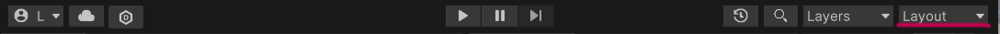

# 编辑器布局设置 - Unity Editor Layout Settings

The default layout of Unity Editor may not be the most comfortable layout for current developers. Here are methods to adjust, save, and quickly import layouts.

1. 打开或者创建一个Unity的项目在Unity Editor中（Open or create a Unity project in the Unity Editor）

<figure><figcaption></figcaption></figure>

2. 按住Tab移动模块重新安排开发布局，直到符合自身开发便捷的布局（Press and hold tab to move the module and rearrange the development layout until it meets the layout that is convenient for your own development.）

<figure><figcaption></figcaption></figure>

3. 点击右上角的“布局”下拉框，选择“保存布局”。后续再打开相同项目的Editor的时候，就会保持当前保存的布局（Click the `Layout` drop-down box in the upper right corner and select `Save Layout .` When you open the Editor of the same project later, the currently saved layout will be maintained.）

<figure><figcaption></figcaption></figure>

<figure><figcaption></figcaption></figure>

4. 如果你希望这个布局未来仍然能被其他项目使用（If you want this layout to still be used by other projects in the future）：



点击右上角的“布局”下拉框，选择“保存布局到文件”，在你能找到的工作文件夹中，点击“保存”，保存wlt类型文件。（Click the layout drop-down box in the upper right corner and select Save layout to file. In the working folder you can find, and save the file with the extension wlt.）

<figure><figcaption></figcaption></figure>

 

<figure><figcaption></figcaption></figure>




打开新的项目在Editor中，点击右上角的“布局”下拉框，选选择“从文件中导入布局”，找到并选中之前保存的wlt文件。（Open a new project in the Editor, click the layout drop-down box in the upper right corner, select Import layout from the file, find and select the previously saved wlt file.）

<figure><figcaption></figcaption></figure>

 

<figure><figcaption></figcaption></figure>

 

<figure><figcaption></figcaption></figure>



